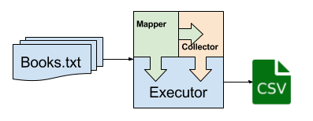

# Goal: Neighborhood Score Benchmarking

The goal of this project is to analyze the performance of programs written for [A0](http://janvitek.org/pdpmr/f17/tasks-a0-neighborhood-score.html
). This is done by collecting execution-time information for the sequential and parallel/concurrent variants of the implementation using the following corpus. For the parallel/concurrent version vary the number of threads (2-16). These are further compared to a mapreduce implementation in Hadoop.

The next step is to prepare a report using R Markdown highlighting the differences in the execution profile of the variants.

* Explain the difference in the execution profiles among variants;
* Comment on the differences in performance of the sequential and parallel/concurrent variants;
* Comment on the impact of the number of executor threads on performance;
* Explain which implementation variant and configuration have the best combination of performance and stability.
* Apart from the results of the evaluation the report should include the specs of the execution environment (Java version, OS version, relevant hardware specs) and a summary description of the design of the evaluated programs.

## Project Outline

This project executes multiple runs and streams the data post completion to the output directory `out/results/`. This project uses simple mapper-collector structure which creates a task (containing one mapper and one collector) for every input file. Then this task is deligated to a threadpool executor which is responsible for running these tasks under maximum number of threads constraints.

NOTE: Collection in our case is a trivial task so it is done in parallel under main thread. Thread limits are applicable to the mappers only.



### Sequential Execution

For this part of the project we will the tasks generated above with one thread in executor. It will automatically call execution in serial format.

### Parallel Execution

For this part we will run the same tasks generated above with multiple threads in the threadpool executor.

## Hadoop Execution

We use Makefile configuration to execute this in Hadoop cluster.

## Building Instructions

```
$ make build
```

## Execution Instructions

To execute the project use the following command:
```
$ make exec
```
The parameters can be adjusted with the use of `config.properties` file located under `<project root>/resources/non_packaged`. These properties control the number of threads, the number of warmup and measurement iterations, input/output locations for the data set.

Default locations:
* Input: By default this project will search for input under `<project root>/input/**`.
* Output: By default output will be stored in `<project root>/out/results`.

## End-to-end Execution

Use the following make command to the project end to end.
```
make all
```