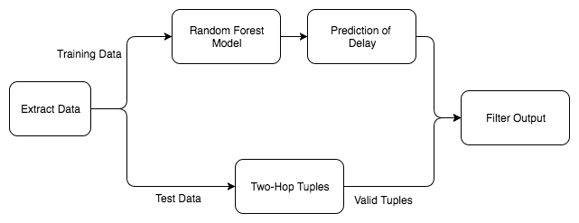

```{r setup, echo=FALSE, results='hide',message=FALSE, warning=FALSE, cache=FALSE}
setwd(getwd())
library(ggplot2)
library(scales)
library(plyr)
library(microbenchmark)
library(reshape2)
```

The goal of our mapreduce workflow is to output the candidate list of all possible two-hop flights between a given source and destination airport. The assignment also uses a machine learning model to predict estimated delays of flights. These predictions aid in the process of selecting the two-hop flights with less chances of missing a connection between two airports.

As the problem statement describes, the program takes as input, queries in the form of tuples of the following format - `(Year, Month, Day, Origin, Destination)`. And the program is expected to output a list of propsed flights connecting the soure and destination airports in each of the input queries. The format of the output list is of the form - `(Year, Month, Day, Flight1_Departure, Flight1_Arrival, Airline, Origin, Destination),`
`(Year, Month, Day, Flight2_Arrival, Airline, Origin, Destination)`

##Program Design
We decided to divide the assignment into threee logical components as seen in the `taskA5` method of the `Main.java` class. First we clean and extract the training data from the entire data set and also separate out the test data (the data pertaining to query year). Next we take the test data for the year being queried and generate suggested output tuples of flights that connect query source and destination airports. One of the requirements of the assignment was to consider connections with at least 45 minutes between landing and takeoff, and no more than 12 hours. The second job `Genrate2HopTuples` takes care of this criteria and discards all records/flight options that fail to meet the condition. The last task is to filter out flight combinations based on the arrival time of the first flight and the departure time of the second flight. The last `FlightScorer` task also takes into account the predicted delay times estimated by the learning model all the while assigning certain score to each combination. At last the filtered output combinations are written to a csv file.

The image below gives a high level view of the operations performed over the course of the program implmentation. The chart briefly illustrates the steps described above.  
```{r out.width = "400pt", height = "400pt", echo=FALSE}
 
```

## Implementation Details
Our design of mapreduce flow emphasizes on reducing the number of passes made over the data. Among all the jobs dataset is only read once and subsequent operations are performed on relatively smaller datasets.

For consistency and ease of using common conventions throughtout the program, we defined a few common types. The are `Flight`, `Query` and `FlightTuple` where FlightTuple is a pair of flights (leg1 and leg2) along with some relevant information about the connection. 

####First Mapreduce Job  
#####Mapper
The mapper relies on a custom CSV parser to filter out mismatched data. Once each record is parsed, the mapper performs sanity checks on the data and emits the record with 'YEAR' as key if all the checks are validated.

* Input the records in the dataset

* Emit key value pairs according to the input: (YEAR , DATA_RECORD)

#####Reducer
* Reduce the results to (NullWritable, DATA_RECORD) format, categorizing them into two folders. One for training data and one for test data. Test data contains all the records pertaining to the queried year.

* For training data, this reducer also performs additional filtering based on range of historic data we are interested in. This range in configurable in the Makefile.

* The reducer finally write to multipleOutputs which are aggregated once the job is complete.

####Second Mapreduce Job

#####Mapper
The mapper for this job sets up stage for the reducer to generate valid flight combinations in a tuple format. For this purpose the mapper takes as input from each record and outputs a combination of origin airport and corresponding Flight Object.

* Input the records from first job's output. 
* Emit key value pairs according to the input: (ORIGIN, FLIGHT)
* Key thing to note here is the mapper outputs such key value pairs for every query in the program input queries. 

#####Reducer
The key set in the Mapper helps categorize all the entries with the same origin to land in the same reducer. This helps aggregate data much faster and better. The reducer for this job first collects all the flights for a given key. Then it iterates over each query from the input queries and aggregates over flights that can have a possible connection for the given query origin and destination.

* Iterate over all queries and aggregate over all the flights for certain key.

* For each pair of possibly connecting flights, filter out the bad ones. As discussed above, the ones with an overlay of less than 45 minutes and greater than 12 hours, we discard such possiblities.

####Scoring Task
The last task that pieces together all the operations is the scoring task. This is not a mapreduce job. Essentially the scoring task performs two operations.

* It uses an instance of the MLmodel and trains over the training data seperated out at the first task. The predictions made by the model are used in the later part of the operations to decide if a flight tuple (combination) is a good suggestion or not.

* It also iterates over the flight tuples generated by the second mapreduce job to filter out the ones that do not make for a good candidate connections.

This task bases it's decisions on two factors. Firstly if the predicted delay estimated by the model, for a flight is higher than the scheduled lay over time between leg1 and leg2 of a given combination, the combination is marked as a bad candidate and dropped from the solution list. Second, the task adds up a score over all the resultant combinations, where each combination is given +1 if the actual delay for leg1 less than the the scheduled lay over time between the two legs. Otherwise a score of -100 is assigned. At the end of the task, the score determined if the flight connections in the solution set make for a good suggestion or not based on the score calculated.

#### Assumptions and Specifications

* By default the training model takes a min and max training year of `queryYear -2` and `queryYear -1` respectively. But this range in configurable in the `Main.java` file.
* Throughout the program a generalization about arrival times of a flight is made, which is that we are only interested in the arrival time of a flight at a connecting airport. In other words a flight arriving with a delay at the final destination of the query is tolerable in comparison to a flight being late at an airport that connected two legs of a journey.

##Performance and Accuracy

#### Model

Weka jar is used to build and evalute models. In particular we found that creating Random Forest would be more suitable for our scenario. Other models such as J48, Bagging were ignored as they take very long to execute. Random Forest model seemed like a best fit given that it can handle high dimensional spaces and large training samples.

####Results

Random forest with Depth 10  
Precision (proportion of the predicted flight delays that were correct) 82.3: %
Data Set: year of 1989

####Performance 

Pseudo Distributed Mode

Time taken: 8 mins with 4gb Heap Size runs out of heap space during the training phase of the model. Changing the Runtime Parameters to '-Xmx6g' under Java Runtime Environment Settings does not seem to resolve the issue either.

EMR Cluster

Time taken: 5 mins
Master: 1 m3.xlarge
Core: 3 m3.xlarge
Same issue of running out of heap space is encountered.

##Conclusion

* Although in theory Random Forest seemed like a good approach to predict delays of flights, in practice when dealing with large data we found that it takes a long time to train even on a small subset of one year of data. Often, since the trianing data size is very large, we run into java heap space issues. Even on an EMR cluster with modified heap space, the same issue remains.

* To fix the issues, we could try to reduce the size of the data.

* As an alternative, we could also try out regression techniques like linear or logistic regression using R. This is an approach we considered too late in the assignment to be able to fully implement and generate results.
 
* Additional features such as weather,security delays at arrival or departure airport that contribute to a flight's delay were not factored in. This additional information could have helped us get better predictions and improve accuracy.

##Task Assignment
As described earlier, the program was divided into three logical components. And each of us took ownership of one component.  

Yu worked on creating the first mapreduce job that separates the training data from the test data. He also contributed to the process of building the ML model using Randon Forest algorithm.

Shabbir took over the second mapreduce job of generating the valid tuple combinations for the given input queries. He also helped with integrating components of the program together and running them.

Navya worked on the third component of scoring and filtering the output tuples generated by the second job. She also worked on documenting the report and README for this assignment.
